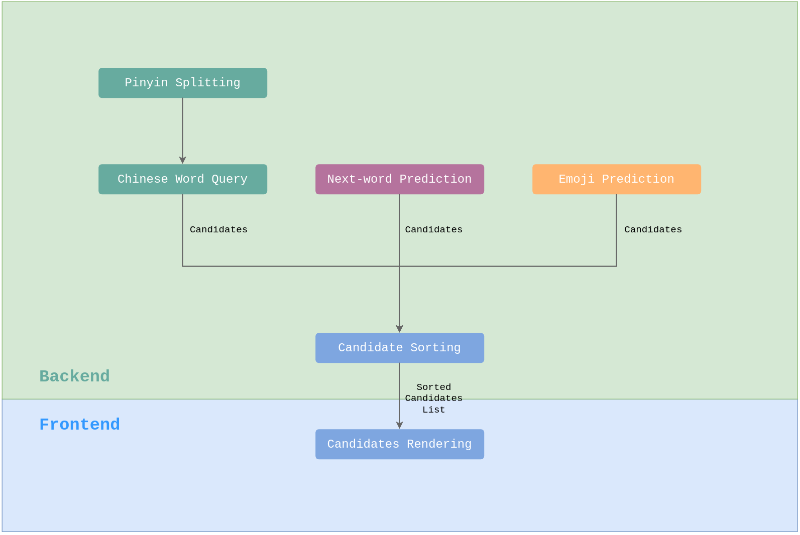

# 中文输入法设计

[English README](./README.md)

这个仓库展示了中文输入法核心算法架构设计的一个基础范例。

## 1. 总览

## 2. 拼音切分

### 2.1 定义

`zhongwen` to `zhong'wen`

### 2.2 相关技术

- [字典树 - 维基百科](https://en.wikipedia.org/wiki/Trie)

## 3. 中文查词

### 3.1 定义

`zhong'wen` to `[ "中文", "仲文" ]`

### 3.2 相关技术

- 中文拼音字典

## 4. 下一词预测

### 4.1 定义

**下一词预测**指的是根据用户输入的上下文预测最可能的下一词（候选词）。

### 4.2 相关技术

- N-gram: Peter F Brown, Vincent J Della Pietra, Peter V Desouza, Jennifer C Lai, and Robert L Mercer. 1992. *Class-based n-gram models of natural language*. Computational Linguistics 18, 4 (1992), 467–480.
- Transformers: [pretrained models](https://huggingface.co/transformers/pretrained_models.html), [a GitHub repo](https://github.com/renatoviolin/next_word_prediction)
- [清源 CPM](https://cpm.baai.ac.cn/)
- [jieba](https://github.com/fxsjy/jieba)
- [sego](https://github.com/huichen/sego)

## 5. 表情符号预测

### 5.1 定义

**表情符号预测**指的是预测与用户输入上下文关联的最可能的表情符号（候选词）。

### 5.2 相关技术

- W. Ma, R. Liu, L. Wang, and S. Vosoughi, *Emoji prediction: Extensions
and benchmarking*, in Proceedings of the Conference on Empirical
Methods in Natural Language Processing, 2020.
- S. Ramaswamy, R. Mathews, K. Rao, and F. Beaufays, *Federated
learning for emoji prediction in a mobile keyboard*, arXiv preprint
arXiv:1906.04329, 2019.
